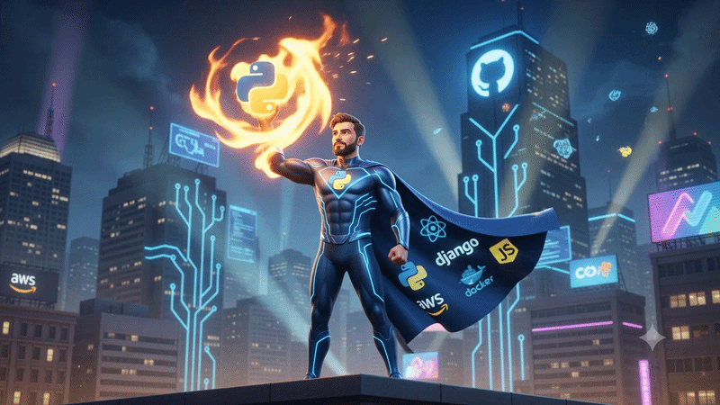

<div align="center">

<!-- ═══════════════════════════════════════════════════════════════ -->
<!--                        HERO BANNER                            -->
<!-- ═══════════════════════════════════════════════════════════════ -->


<!-- ANIMATED TYPING -->


<br/>

<!-- SOCIAL LINKS -->
<a href="https://www.linkedin.com/in/kashyaptrivedii" target="_blank">
  
</a>
<a href="https://github.com/Kashyap-Trivedi" target="_blank">
  
</a>
<a href="mailto:kdtrivedi96@gmail.com">
  
</a>

<br/><br/>

<!-- PROFILE COUNTERS -->


</div>

<br/>

<!-- ═══════════════════════════════════════════════════════════════ -->
<!--                       ANIMATED GIF                            -->
<!-- ═══════════════════════════════════════════════════════════════ -->

<div align="center">

</div>

<br/>

<!-- ═══════════════════════════════════════════════════════════════ -->
<!--                     IMPACT NUMBERS                            -->
<!-- ═══════════════════════════════════════════════════════════════ -->

<div align="center">

<table border="0" cellspacing="0" cellpadding="0">
<tr>
<td align="center" width="200">

</td>
<td align="center" width="200">

</td>
<td align="center" width="200">

</td>
<td align="center" width="200">

</td>
</tr>
</table>

</div>

<br/>

---

<!-- ═══════════════════════════════════════════════════════════════ -->
<!--                       ABOUT ME                                -->
<!-- ═══════════════════════════════════════════════════════════════ -->

## 🧠 About Me

```python
class KashyapTrivedi:

    name       = "Kashyap Trivedi"
    role       = "Data Automation Analyst @ TAB & SPACE"
    location   = "Vadodara, Gujarat, India 🇮🇳"
    experience = "7+ years in Automation · Reporting · Workflow Engineering"

    currently_working_on = [
        "Python automation frameworks for operational pipelines",
        "LLM API integrations (ChatGPT · Claude · Gemini)",
        "n8n multi-step workflow orchestration",
    ]

    learning = [
        "Django · FastAPI · React",
        "AWS · Docker · System Design",
        "PostgreSQL · MongoDB · Redis · Vector DBs",
    ]

    ask_me_about = [
        "Python scripting & process automation",
        "Excel / VBA reporting systems",
        "Prompt Engineering & LLM integrations",
        "Operational workflow design",
    ]

    fun_fact = "I once automated a 4-hour manual task in under 30 minutes 🚀"
```

> 🏆 **Above & Beyond Performer** — Recognized at TAB & SPACE for exceptional automation impact and operational excellence.

<br/>

---

<!-- ═══════════════════════════════════════════════════════════════ -->
<!--                      TECH STACK                               -->
<!-- ═══════════════════════════════════════════════════════════════ -->

## 🛠️ Tech Stack & Skills

<br/>

### ⚙️ &nbsp; Automation & Core Python

<div align="center">

[](https://skillicons.dev)
&nbsp;


</div>

<br/>

### 🔧 &nbsp; Backend Development

<div align="center">

[](https://skillicons.dev)
&nbsp;


</div>

<br/>

### 🎨 &nbsp; Frontend

<div align="center">

[](https://skillicons.dev)

</div>

<br/>

### ☁️ &nbsp; Cloud & DevOps

<div align="center">

[](https://skillicons.dev)

</div>

<br/>

### 🗄️ &nbsp; Databases

<div align="center">

[](https://skillicons.dev)

</div>

<br/>

### 🤖 &nbsp; AI / LLM & Emerging Tools

<div align="center">

[](https://skillicons.dev)
&nbsp;


</div>

<br/>

### 📊 &nbsp; Reporting & Analytics

<div align="center">

[](https://skillicons.dev)
&nbsp;


</div>

<br/>

---

<!-- ═══════════════════════════════════════════════════════════════ -->
<!--                    FEATURED PROJECTS                          -->
<!-- ═══════════════════════════════════════════════════════════════ -->

## 🚀 Featured Projects

<br/>

<div align="center">

| 📋 &nbsp; [Assessment Result Automation System](https://github.com/Kashyap-Trivedi/Assessment-result-automation-system) | 📄 &nbsp; [MCQ Document Processing Tool](https://github.com/Kashyap-Trivedi/mcq-document-processing-automation-tool) |
|:---|:---|
| End-to-end Python pipeline — raw exam data → scoring → scorecards | CustomTkinter desktop app — unstructured docs → structured Excel |
| ✅ Supports **100+ assessment cycles** with zero manual intervention | ✅ Eliminates **4+ hours** of manual data entry per cycle |
| ✅ Fully auditable, structured delivery pipeline | ✅ Zero transcription errors post-deployment |
| `Python` `Pandas` `OpenPyXL` | `Python` `CustomTkinter` `OpenPyXL` |

| 🔍 &nbsp; [AI-Assisted Tender Discovery Pipeline](https://github.com/Kashyap-Trivedi/AI-assisted-tender-discovery-automation-system) | 📁 &nbsp; [File Retrieval & Workflow Automation Utility](https://github.com/Kashyap-Trivedi/python-file-retrieval-automation-tool) |
|:---|:---|
| LLM API integration — multi-source discovery → structured reports | Desktop Python utility — intelligent file search & copy/move automation |
| ✅ Reduced tender research from **hours → minutes** | ✅ Standardized ad hoc file management across teams |
| ✅ Integrates ChatGPT, Claude & Gemini APIs | ✅ Eliminated recurring manual handling incidents |
| `Python` `LLM APIs` `Pandas` | `Python` `Tkinter` `OS/Shutil` |

</div>

<br/>

---

<!-- ═══════════════════════════════════════════════════════════════ -->
<!--                    GITHUB ANALYTICS                           -->
<!-- ═══════════════════════════════════════════════════════════════ -->

## 📈 GitHub Analytics

<br/>

<div align="center">


&nbsp;


<br/><br/>


<br/><br/>


</div>

<br/>

---

<!-- ═══════════════════════════════════════════════════════════════ -->
<!--                     WORK HISTORY                              -->
<!-- ═══════════════════════════════════════════════════════════════ -->

## 💼 Work History

<br/>

```
📍 TAB & SPACE (formerly RichMinds Digital) · Vadodara         Jun 2023 – Present
   MIS Executive & Data Automation Analyst
   → Python automation frameworks · LLM API pipelines · 60-70% time reduction

📍 Searce Inc. · Rajkot                                        Dec 2018 – May 2023
   Analyst — Analytics & Operational Reporting
   → SLA/KPI analysis · Dashboard design · 50% reporting effort reduction

📍 Codizious Technologies · Rajkot                             Aug 2017 – Feb 2018
   Technical Trainee — Web Development
   → PHP · Laravel · CodeIgniter · WordPress · Full-stack foundations
```

<br/>

---

<!-- ═══════════════════════════════════════════════════════════════ -->
<!--                  EDUCATION & CERTS                            -->
<!-- ═══════════════════════════════════════════════════════════════ -->

## 🎓 Education & Certifications

<br/>

<div align="center">

| 🏛️ Degree | 🏫 Institution | 📅 Year |
|:---:|:---:|:---:|
| B.E. — Information Technology | Atmiya Institute of Technology & Science, Rajkot | 2015 – 2018 |
| Diploma — Information Technology | Government Polytechnic, Rajkot | 2011 – 2014 |

</div>

<br/>

<div align="center">


</div>

<br/>

---

<!-- ═══════════════════════════════════════════════════════════════ -->
<!--                      SNAKE ANIMATION                          -->
<!-- ═══════════════════════════════════════════════════════════════ -->

## 🐍 Contribution Snake

<div align="center">

<picture>
  <source media="(prefers-color-scheme: dark)" srcset="https://raw.githubusercontent.com/Kashyap-Trivedi/Kashyap-Trivedi/output/github-contribution-grid-snake-dark.svg"/>
  <source media="(prefers-color-scheme: light)" srcset="https://raw.githubusercontent.com/Kashyap-Trivedi/Kashyap-Trivedi/output/github-contribution-grid-snake.svg"/>
  
</picture>

</div>

<br/>

---

<!-- ═══════════════════════════════════════════════════════════════ -->
<!--                        FOOTER                                 -->
<!-- ═══════════════════════════════════════════════════════════════ -->

<div align="center">


<br/><br/>


</div>
